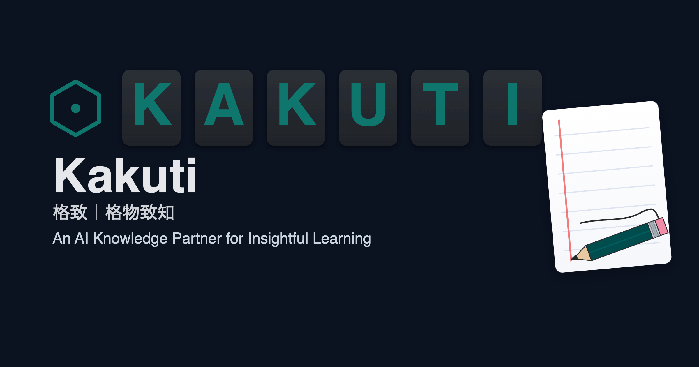

---
 [物語](story/STORY.jp.md) ｜ [Story](story/STORY.en.md) ｜ [故事](story/STORY.cn.md) 
---

### 日本語

プロジェクト名：Kakuti — 知識管理と学習を支援するインテリジェントアシスタント  
本プロジェクトは、PDF/Markdown 編集、インタラクティブなハイライト、翻訳、RAG（検索強化生成）を融合した個人向け知識プラットフォームを構築します。  
単なるノートツールではなく、ユーザーが 知識を内化し、学習体験を向上させ、成長を加速 するためのパートナーです。
- 日本語 [README](README.jp.md)
---
### 中文

项目名称：Kakuti — 智能知识管理与学习助手  
本项目旨在构建一个融合 PDF/Markdown 编辑、交互式标注、翻译与检索增强（RAG） 的个人知识平台。  
它不仅是一个笔记工具，更是一个帮助用户 内化知识、提升学习体验、增长能力 的伙伴。

- 查看中文 [README](README.cn.md)
---

### English

Project Title: Kakuti — Intelligent Knowledge Management & Learning Assistant  
This project creates a personal knowledge platform that integrates PDF/Markdown editing, interactive annotation, translation, and Retrieval-Augmented Generation (RAG).  
It goes beyond note-taking, serving as a companion that helps users internalize knowledge, enhance learning experience, and accelerate growth.

- Read English [README](README.en.md)
---