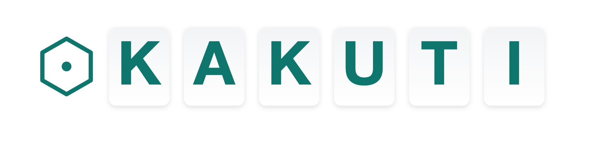

在这个时代，AI 工具层出不穷。  
它们帮助我们写邮件更快、生成报告更快、处理信息更快。  
但我慢慢意识到：**快，并不等于成长**。  

如果 AI 只是替我们完成任务，我们短期内节省了时间，  
却失去了最宝贵的东西——**提升自身能力的机会**。  

## 我的思考

学习是人类最核心、最独特的能力之一。  
而真正的学习，并不是“拿到答案”，  
而是**在思考、提问、探索的过程中，逐渐构建自己的理解与判断**。  

然而，现有的大多数 AI 工具只关注“效率”：  
它们能帮你生成一份报告，却很少引导你深入理解；  
它们能帮你翻译一段文字，却很少帮助你内化其中的知识。  

这让我感到遗憾。  
我希望有一个工具，不只是“帮我更快做事”，  
而是**帮助我成为一个更强大的人**。  

## Kakuti 的使命

这就是 Kakuti 的起点。  
Kakuti 的使命，不是单纯追求“生产效率”，  
而是聚焦在**如何让人通过 AI 更好地学习和成长**。  

名字本身就蕴含了这一使命：  

- **Kakuti = 格致**：取自“格物致知”，意为通过探究事物，达到真正的理解与智慧。  
  它提醒我们，学习的价值不在于快速得到答案，  
  而在于通过不断追问、分析、归纳而获得能力的提升。  
- **Kaku（書く）**：日语里的“书写／记录／描画”，代表把思考外化的过程。  
- **Chi（知）**：知识、理解、洞见。   

在 Kakuti 里，AI 不再是一个“代劳者”，而是一个“思考伙伴”：  

- **在阅读中对话**：当你读一篇复杂的论文或标准文档时，你可以直接向它提问，让它引导你厘清结构、洞察重点。  
- **帮助深入思考**：不是简单给出结果，而是提供不同角度的解释和追问，促使你去理解“为什么”，而不是只满足于“是什么”。  
- **沉淀与连接**：每一次提问、标注和总结，都会沉淀为长期可复用的知识资产，而不仅仅是一次性的回答。  

## Kakuti的愿景

**做一个帮助人们内化知识、提升能力的 AI 知识伙伴。**  