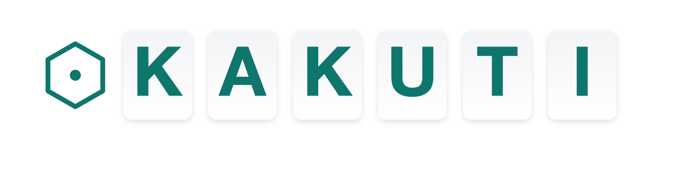

In this age, AI tools are everywhere.  
They help us write emails faster, create reports faster, and process information faster.  
But I gradually realized: fast does not equal growth.

If AI only completes tasks on our behalf, we may save time in the short term,  
but we also lose something precious — the opportunity to strengthen our own abilities.

## My Reflection

Learning is one of the most essential and unique human abilities.  
True learning is not about “getting the answer,”  
but about gradually forming one’s own understanding and judgment through thinking, questioning, and exploration.

Yet most current AI tools focus primarily on “efficiency.”  
They can generate a report for you, but rarely guide you to deeper understanding;  
they can translate a paragraph, but rarely help you internalize the knowledge behind it.

That feels like a missed opportunity.  
I want a tool that doesn’t just help me “do things faster,”  
but helps me become a stronger person.

## Kakuti’s Mission

This is where Kakuti begins.  
Kakuti’s mission is not simply to chase “productivity,”  
but to focus on how AI can help people learn and grow better.

Even the name embodies this mission:

- Kakuti = “格致” (Chinese: 格物致知): from “investigating things to attain knowledge,”  
  reminding us that the value of learning isn’t in instant answers,  
  but in refining our abilities through continuous inquiry, analysis, and synthesis.
- Kaku (書く, Japanese): to write/record/draw — the act of externalizing thought.  
- Chi (知): knowledge, understanding, insight.

In Kakuti, AI is not a “proxy that does the work,” but a “thinking partner”:

- Dialogue while reading: When facing a complex paper or standard, ask questions directly;  
  let AI help you map structure and highlight key points.
- Deepen thinking: Not just answers — offer multiple angles and follow‑up questions,  
  encouraging you to understand the “why,” not only the “what.”
- Accumulate and connect: Every question, highlight, and summary becomes reusable knowledge —  
  not just a one‑off answer.

## Kakuti’s Vision

To achieve:  
an AI knowledge partner that helps people internalize knowledge and elevate their abilities.

